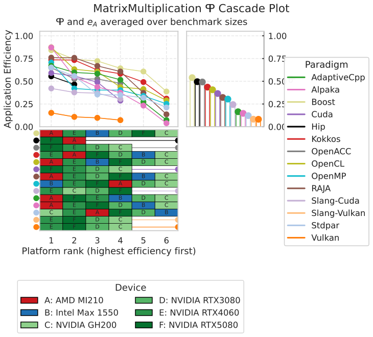
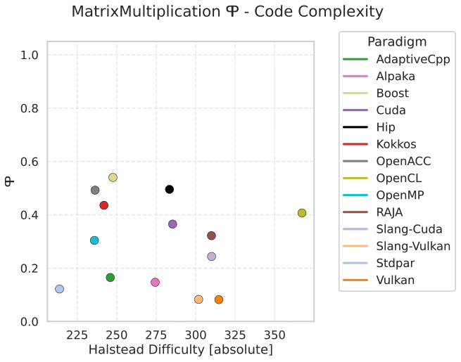
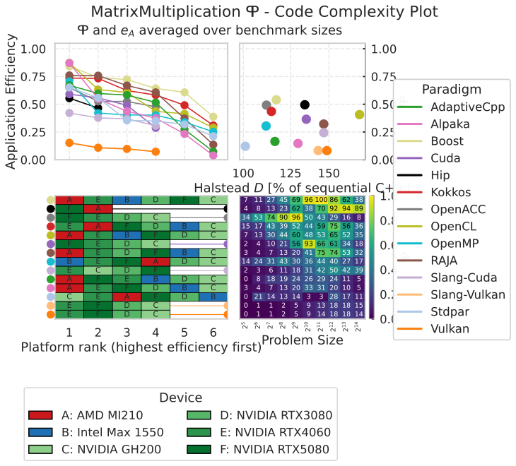
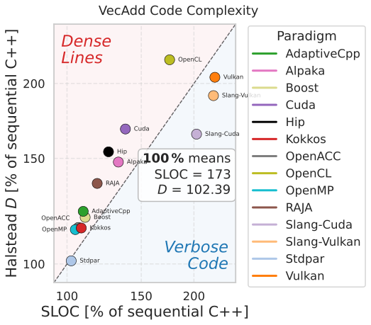
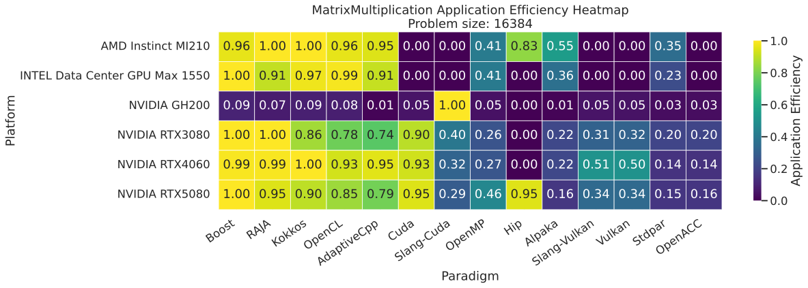
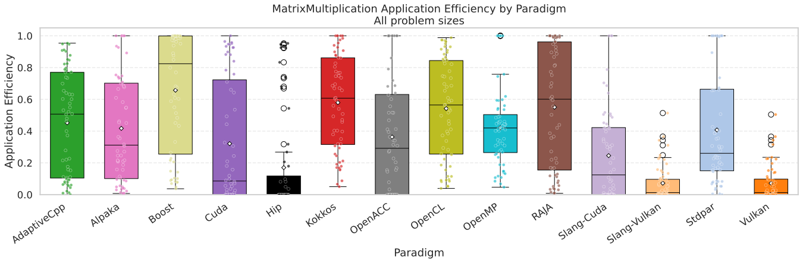
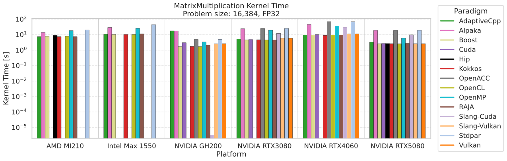

.. _plots:

Available Plots
===============

``ppbcc p2analysis`` and ``ppbcc p3analysis`` render eight chart types, selected
by their first argument, and one table. All of them are shown below, all but one
for the same benchmark problem, so they can be compared directly.

.. admonition:: Where this data comes from
   :class: note

   Every figure on this page was produced from the measurement data in the
   ``results/`` folder of the companion repository
   `performance-portability-benchmark <https://github.com/schuhmaj/performance-portability-benchmark>`__.

   * **Runtimes** — the per-platform ``Results_*.csv`` files
     (``Results_AMD_MI210.csv``, ``Results_Intel_Max_1550.csv``,
     ``Results_NVIDIA_GH200.csv``, ``Results_NVIDIA_RTX3080.csv``,
     ``Results_NVIDIA_RTX4060.csv``, ``Results_NVIDIA_RTX5080.csv``), each
     consolidated from Google Benchmark JSON reports by
     :doc:`ppbcc benchmark <benchmark>`.
   * **Complexity** — ``results/code-complexity/code-complexity.csv``, produced
     by ``scripts/generate_code_complexity.py`` on top of
     :doc:`ppbcc code-complexity <code_complexity>` (see
     :ref:`code-complexity-applied-example`).

   The shown problem is **matrix multiplication** across six GPU platforms,
   averaged over benchmark sizes, with the cuBLAS reference excluded so the
   vendor library does not define the efficiency baseline on its own.
   The complexity comparison shows **vector addition** instead, whose small
   implementations make the difference between the two metrics easy to read.
   The source PDFs live in the ``examples/`` folder of this repository.

Chart overview
--------------

+---------------------------+-------------------------------------------------+-------------------+
| Chart                     | Shows                                           | Command           |
+===========================+=================================================+===================+
| ``cascade``               | Efficiency decay across ranked platforms + PP   | ``p2analysis``    |
+---------------------------+-------------------------------------------------+-------------------+
| ``navchart``              | PP against code complexity                      | ``p3analysis``    |
+---------------------------+-------------------------------------------------+-------------------+
| ``combined``              | Cascade + Navchart + size scaling in one figure | ``p3analysis``    |
+---------------------------+-------------------------------------------------+-------------------+
| ``complexity-comparison`` | Two complexity metrics against each other       | ``p3analysis``    |
+---------------------------+-------------------------------------------------+-------------------+
| ``heatmap``               | Efficiency per paradigm and platform            | ``p2analysis``    |
+---------------------------+-------------------------------------------------+-------------------+
| ``double-heatmap``        | Efficiency at two sizes, one split cell each    | ``p2analysis``    |
+---------------------------+-------------------------------------------------+-------------------+
| ``boxplot``               | Efficiency distribution per paradigm            | ``p2analysis``    |
+---------------------------+-------------------------------------------------+-------------------+
| ``time-barplot``          | Runtime per paradigm, grouped by platform       | ``p2analysis``    |
+---------------------------+-------------------------------------------------+-------------------+
| ``rank-correlation``      | CSV: do two problems rank the paradigms alike?  | ``p3analysis``    |
+---------------------------+-------------------------------------------------+-------------------+

Cascade plot
------------

The Cascade plot is the canonical performance-portability figure. The left
panel sorts platforms per implementation from highest to lowest application
efficiency, so a flat line means an implementation performs consistently while
a steep drop exposes a platform it struggles on. The right panel shows the
resulting performance portability :math:`\Phi`, and the tile matrix below
identifies which device sits at which rank for each paradigm.

   ``cascade`` — efficiency decay, :math:`\Phi`, and the platform ranking.

.. code-block:: bash

    ppbcc p2analysis cascade ./Results_* -n MatrixMultiplication \
      --non-zero-pp --remove-description -s avg -x "Cublas"

Navchart
--------

The Navchart places each implementation at its code complexity (x-axis) and its
performance portability (y-axis). The upper-left corner is the goal: portable
*and* cheap to write. Pick the complexity axis with ``-c/--complexity-metric``.
Complexity is expressed as a percentage of the plain-C++ implementation unless
``--complexity-metric-absolute`` is given.

   ``navchart`` — :math:`\Phi` against absolute Halstead difficulty.

.. code-block:: bash

    ppbcc p3analysis navchart ./code-complexity/code-complexity.csv ./Results_* \
      -n MatrixMultiplication -c halstead-difficulty --complexity-metric-absolute \
      --non-zero-pp --remove-description -s avg -x "Cublas"

Combined chart
--------------

The combined chart is the summary figure: Cascade panels, the Navchart, and a
problem-size scaling panel in one layout, sharing a single legend. It is the
one to put in a paper when you have room for exactly one figure.

   ``combined`` — Cascade, Navchart (normalized complexity), and performance
   portability over problem size.

.. code-block:: bash

    ppbcc p3analysis combined ./code-complexity/code-complexity.csv ./Results_* \
      -n MatrixMultiplication -c halstead-difficulty --log-complexity \
      --non-zero-pp --remove-description -s avg -x "Cublas"

The Navchart panel sits on a *percentage of plain C++* axis. Every value is
positive, which is what makes ``--log-complexity`` usable — and the log axis
matters whenever one implementation dwarfs the rest, as the two CUDA polyhedral
implementations do at roughly 500 % of the baseline.

The scaling panel is a **heatmap** over the benchmark sizes, one row per
implementation and one column per size, because a line per implementation
becomes unreadable beyond a handful of paradigms. Its rows keep the
descending-:math:`\Phi` order of the platform-ranking panel beside it, so the
two lower panels line up row for row.

Column labels become exponents whenever every size is an exact power of one
base — :math:`2^5 \ldots 2^{14}`, :math:`10^1 \ldots 10^8` — which is short
enough to sit horizontally within one column at a size slightly above the cell
values. A sweep that is not a clean power sequence keeps upright decimal labels
at a smaller size, since labels that long would grow the figure's bounding box.

Complexity comparison
---------------------

``complexity-comparison`` answers whether two complexity metrics rank the
paradigms differently. Each paradigm is one marker, both axes are relative to
the plain-C++ baseline, and the identity line splits the plane: above it the
y-axis metric charges a paradigm more than the x-axis one — *dense lines* — and
below it the x-axis metric charges more — *verbose code*, which is how the two
half-planes are captioned.

   ``complexity-comparison`` — Halstead difficulty against SLOC for vector
   addition, both relative to plain C++.

.. code-block:: bash

    ppbcc p3analysis complexity-comparison ./code-complexity/code-complexity.csv \
      ./Results_* -n VecAdd -c halstead-difficulty --compare-metric sloc \
      --log-complexity --non-zero-pp -s avg -x "Cublas" --remove-description

``--compare-metric`` names the x-axis metric and ``-c/--complexity-metric`` the
y axis; both take the usual metric names and aliases. Because the identity line
only means something on a shared relative scale, the chart rejects
``--complexity-metric-absolute``. ``-l`` suppresses the in-plot legend *and* the
per-point paradigm labels, for placing the chart next to a shared legend.

A key on the right states the absolute plain-C++ values behind the 100 % of
both axes, so the chart can be read without the running text. It hangs from
half height into the lower-right corner, which the markers leave free because a
paradigm below the identity line on one axis is rarely far below it on the
other. A chart spanning several problems has several baselines and therefore no
key.

Spearman's :math:`\rho` and Kendall's :math:`\tau` are not drawn; they belong
in the running text, where they can be given to three decimals and discussed.

Efficiency heatmap
------------------

The heatmap trades the ranking abstraction for raw numbers: one cell per
paradigm and platform, annotated with the application efficiency. Platforms an
implementation was never benchmarked on are drawn as black cells with a dash
rather than as an efficiency of zero — they are what drives :math:`\Phi` to zero
without ``--non-zero-pp``. The color scale is fixed to :math:`[0, 1]`, so
heatmaps of different problems remain comparable.
Paradigms are ordered by descending mean efficiency; ``--sort-alphabetically``
orders them by name instead, which applies to ``double-heatmap`` as well.

   ``heatmap -s 16384`` — application efficiency at one problem size.

.. code-block:: bash

    ppbcc p2analysis heatmap ./Results_* -n MatrixMultiplication \
      --non-zero-pp --remove-description -s 16384 -x "Cublas"

Double efficiency heatmap
-------------------------

``double-heatmap`` compares two problem sizes in one figure. Every cell is split
along its diagonal: the upper-left triangle shows the size given with ``-s``,
the lower-right triangle the size given with ``--second-size``. Both sizes must
be exact numeric sizes, and both halves share the fixed :math:`[0, 1]` color
scale. A half whose paradigm was never benchmarked on the platform at that size
is black with a dash.

.. code-block:: bash

    ppbcc p2analysis double-heatmap ./Results_* -n MatrixMultiplication \
      --remove-description -s 1024 --second-size 16384 -x "Cublas"

Efficiency boxplot
------------------

The boxplot shows the *distribution* of application efficiency for each
paradigm across all platforms and problem sizes, with the individual
observations overlaid. A tall box means the paradigm's efficiency depends
strongly on platform or size; a compact box high up means dependable
performance. Paradigms are sorted alphabetically.

   ``boxplot -s all`` — efficiency spread across platforms and sizes.

.. code-block:: bash

    ppbcc p2analysis boxplot ./Results_* -n MatrixMultiplication \
      --non-zero-pp --remove-description -s all -x "Cublas"

Boxplots accept only ``-s all`` or an exact numeric size — the ``avg``,
``best``, and ``worst`` modes collapse the distribution the chart exists to
show. Use ``-H/--hardware`` to restrict a boxplot to a single platform; that
option is an error for every other chart type.

Runtime bar plot
----------------

The runtime bar plot shows the measured time itself: one bar per paradigm in
the paradigm's color, grouped by platform, on a logarithmic axis. Every group
keeps a slot per paradigm in the same order, so a paradigm is found at the same
position on every platform, and a slot stays empty where it has no result. With
``-H/--hardware`` the chart shows a single platform and labels the bars with
their paradigm instead.

   ``time-barplot -t kernel`` — kernel time at the largest matrix size.

.. code-block:: bash

    ppbcc p2analysis time-barplot ./Results_* -n MatrixMultiplication -t kernel \
      -x "Cublas" --remove-description

``-t/--time`` selects the runtime column — ``wall-clock`` (default),
``kernel``, ``force-update`` or ``neighbor-search`` — and a column the selected
results do not contain is an error rather than an empty chart. The chart uses
the largest benchmark size unless ``-s`` names another one; the ``avg``,
``best`` and ``worst`` summaries are rejected, because they would put runtimes
of different sizes into one bar. Runtimes that are missing or not positive are
dropped with a warning, since a logarithmic axis cannot show them. With
``--remove-description`` the fastest variant stands for its paradigm.

``--normalize-time-to-peak`` multiplies every runtime by the published peak
performance of its platform and precision, so the axis shows the FLOPs the
platform could have executed in that time. That puts GPUs of very different
capability on one scale: a kernel that is merely fast because it ran on a big
GPU no longer looks better than it is. The peaks are datasheet values taken
from :mod:`ppbcc.hardware`, which cites the source of each one; they are not the
measured ceilings of :doc:`profiling`.

``-e/--export-to-csv`` writes the plotted runtimes next to the chart as
``<plot-prefix>.csv``.

Rank correlation
----------------

Every other chart answers a question about one benchmark problem.
``rank-correlation`` answers one about the set of them: does a problem's
ordering of the paradigms predict the next problem's? It writes Spearman's
:math:`\rho` between every pair of problems as a CSV matrix rather than a
figure, because the interesting content is a handful of numbers that belong in
a table or in running text.

.. code-block:: bash

    ppbcc p3analysis rank-correlation ./code-complexity/code-complexity.csv \
      ./Results_* --correlation pp --non-zero-pp -s avg -x "Cublas" -e

.. code-block:: text

    Problem,MatrixMultiplication,NBody,Polyhedral,VecAdd
    MatrixMultiplication,1.0,0.754,0.776,0.503
    NBody,0.754,1.0,0.785,0.446
    Polyhedral,0.776,0.785,1.0,0.385
    VecAdd,0.503,0.446,0.385,1.0

A high :math:`\rho` means the two problems agree on which paradigms are good;
a :math:`\rho` near zero means one problem says nothing about the other, which
is the case worth knowing about before a single workload is used to argue about
paradigms in general.

``--correlation`` picks the variable that is ranked:

* ``pp`` (default) — performance portability, computed exactly as the other
  charts compute it, so ``-s``, ``--average-over``, ``--non-zero-pp``,
  ``-p/--precision`` and the description filters all apply. The default ``-s
  all`` treats every size as a workload, making :math:`\Phi` the harmonic mean
  over platforms of the size-averaged application efficiencies.
* a complexity metric — ``sloc``, ``halstead-difficulty`` and the other names
  and aliases ``-c/--complexity-metric`` accepts. Values are read unscaled;
  dividing a problem's paradigms by that problem's plain-C++ baseline cannot
  change the problem's order.

Both variables are reduced to one value per **paradigm**, since a paradigm is
what the problems have in common — implementation variants such as
``Cuda[Naive]`` exist in one problem and not the next. The best variant stands
for its paradigm in :math:`\Phi`, and variants are reduced to their median for
a complexity metric. Only paradigms with benchmark results are ranked, so the
plain-C++ baseline and any framework measured for complexity alone stay out and
every variable ranks the same paradigms. Each pair is then correlated over the
paradigms both of its problems have a value for; a pair sharing fewer than
three is left empty with a warning.

``-n/--name`` takes a comma-separated list of problems and defaults to every
problem in the CSVs. ``-e/--export-to-csv`` writes the underlying per-paradigm
values and their ranks — best first, which is the highest :math:`\Phi` or the
lowest complexity — to ``<plot-prefix>_ranks.csv``. Having no figure, the chart
rejects ``-l/--legend``, ``--remove-description`` (which it always implies) and
``--log-complexity``.

Legends and output
------------------

``-l/--legend`` moves the legend out of the figure and saves it as a separate
PDF next to the plot (``<name>_legend.pdf``) with four columns; add
``--legend--vertical`` for a single column. This keeps the plot area usable
when a problem has many paradigms.

``-o/--output`` sets the output path; without a suffix, ``.pdf`` is appended.
The default name is ``<problem>_<chart>.pdf``. ``rank-correlation`` writes
``.csv`` instead, named after every problem it correlated.
